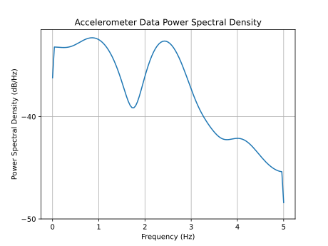
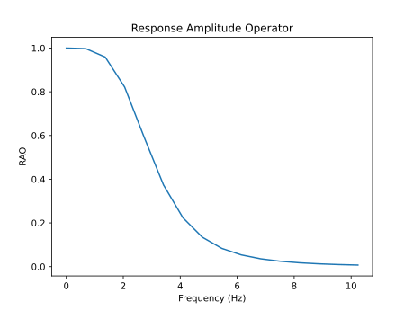
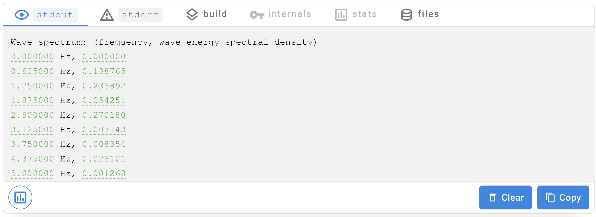
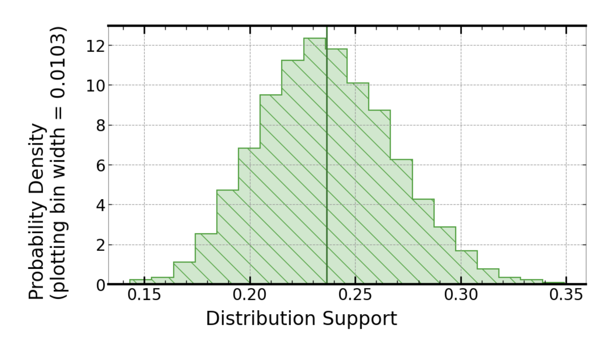

[](https://signaloid.io/repositories?connect=https://github.com/signaloid/Signaloid-Demo-NavalEngineering-WaveSpectrumEstimation#gh-dark-mode-only)
[](https://signaloid.io/repositories?connect=https://github.com/signaloid/Signaloid-Demo-NavalEngineering-WaveSpectrumEstimation#gh-light-mode-only)

# Estimating Wave Energy Spectrum from Accelerometer Measurements

Oceanographers use tools like weather buoys to measure wave data in order to predict the weather, as well as to aid coastal management or even to assist with emergency response. Signaloid's uncertainty tracking processor technology allows oceanographers to quantify the uncertainty in wave spectrum estimates, allowing them to make more accurate predictions.

This application provides a basic illustration of the idea by using accelerometer measurements from an ocean vessel, such as a buoy, ship or AUV, to calculate a heave motion energy spectrum for the vessel. The heave motion spectrum is then combined with the vessel's RAO (Response Amplitude Operator)[^1] characteristic to obtain an estimate for the energy spectrum of waves encountered by the vessel over the measurement period.

Signaloid's uncertainty tracking processor technology tracks measurement uncertainties through the calculation, providing a quantitative measure of uncertainty in the final wave spectrum estimate. In this example, measurement uncertainty is modelled with a uniform distribution with support equal to the uncertainty provided by the user.

## Program Operation
The application performs the following steps when it runs:

1. Calculate a RAO for the vessel from the supplied test data (heave displacement and wave elevation measurements). Typically this data is collected from experiments in a wave tank.
2. Integrate the supplied accelerometer measurements to obtain an estimate for heave displacement under ocean conditions.
3. Combine the heave displacement spectrum with the previously calculated RAO to obtain an estimate for the ocean wave energy spectrum experienced by the vessel.

## Running the program

The program takes the following command line options:

- **[-d Path to heave displacement test measurements]** *(Default value: `testingHeave.csv`)*<br/>
    The path to the CSV file containing time series heave displacement measurements used to characterise the vessel's RAO.

- **[-D Heave measurement uncertainty]** *(Default value: `0.1`)*<br/>
    The measurement uncertainty associated with heave displacement measurements.

- **[-e Path to wave elevation test measurements]** *(Default value: `testingWaveElevation.csv`)*<br/>
    The path to the CSV file containing time series wave elevation measurements used to characterise the vessel's RAO.

- **[-E Wave elevation measurement uncertainty]** *(Default value: `0.1`)*<br/>
    The measurement uncertainty associated with wave elevation measurements.

- **[-a Path to heave acceleration measurements]** *(Default value: `oceanHeaveAcceleration.csv`)*<br/>
    The path to the CSV file containing the time series heave acceleration measurements that will be used to estimate the wave spectrum.

- **[-A Accelerometer resolution]** *(Default value: `0.1`)*<br/>
    The measurement uncertainty associated with the accelerometer.

- **[-t Time period between successive measurements]** *(Default value: `0.1`)*<br/>
    The time period between successive time series measurements (measured in seconds).

- **[-h]**<br/>
    Help flag, displays program usage.

You can run the program yourself by clicking on the "Add to signaloid.io" button at the top of the page.
Note that autocorrelation tracking must be enabled for this example program to give an accurate output. You can enable autocorrelation tracking by selecting a core with autocorrelation tracking enabled.

### Example usage:

Run the program with command line arguments:

```-d testingHeave.csv -D 0.1 -e testingWaveElevation.csv -E 0.1 -a oceanHeaveAcceleration.csv -A 0.1 -t 0.1```

### Example accelerometer input data


This example application includes some randomly generated dummy accelerometer data that can be fed into the wave spectrum calculation. This figure illustrates the power spectral density plot for this input data, assuming a sampling rate of 10Hz.

### RAO for dummy test data


This application also includes some dummy test data (heave displacement and wave elevation measurements) used to calculate an RAO for the vessel. This dummy RAO takes the form of a second order Butterworth filter with 3Hz cutoff frequency.


## Output of the program




Upon completion of the calculation, the program will print up to 9 values from the resulting wave energy spectrum (the entire spectrum is not printed, to avoid cluttering the stdout view).

The wave energy spectrum has units *[distance units]*<sup>2</sup>/Hz, where the distance units are the same as the units used in the input accelerometer data (e.g., metres from accelerations measured in m/s<sup>2</sup>).

By hovering over the printed values, you will be able to view the full uncertainty distribution associated with each value from the spectrum. The source of this uncertainty is the measurement uncertainty from the accelerometer used to gather the raw data (modelled in this example as a uniform distribution).

Below is an illustration of the distribution for the 1.25Hz value in the above wave energy spectrum:



[^1]: United States Naval Academy Course EN455: Seakeeping and Maneuvering (https://www.usna.edu/NAOE/academics/en455.php)
